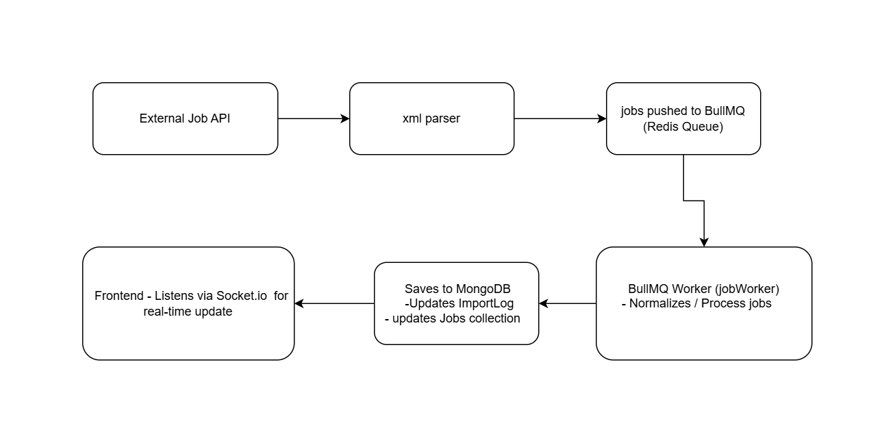

# 🏗️ System Architecture – Job Importer App

This document explains the high-level architecture, flow of data, and interaction between components in the Job Importer System.

---

## 📌 Overview

The system is designed to:

- Fetch jobs from RSS/XML feeds.
- Process jobs via a background worker queue.
- Log imports in a MongoDB collection.
- Emit real-time job status updates via WebSocket to the frontend.
- Display the job import history in a user-friendly dashboard.

---

## 🧱 Architecture Diagram

---

## ⚙️ Component Breakdown

### 1. **Frontend (Next.js + Tailwind)**
- Displays import history.
- Connects to Socket.IO for real-time updates.
- Consumes API to fetch existing import logs.

### 2. **API Server (Express)**
- Exposes routes to:
  - Fetch job feed and enqueue jobs.
  - Fetch logs from MongoDB.
- Parses and normalizes RSS/XML job data.

### 3. **Redis + BullMQ**
- Acts as a job queue system.
- Processes jobs in background with retry + backoff.
- Supports concurrency via `Worker` configuration.

### 4. **Worker (BullMQ)**
- Listens to the `job-importer` queue.
- Saves/updates jobs in MongoDB.
- Builds `resultsMap` to group new, updated, and failed jobs.
- Emits real-time updates through `Socket.IO`.

### 5. **MongoDB**
- Stores:
  - All job records (with `jobId` as unique key).
  - Detailed `ImportLog` with job counts and types.

---

## 🔁 Data Flow

1. User or cron triggers feed import.
2. Server parses feed and pushes jobs to Redis queue.
3. Worker picks jobs from queue and processes:
   - Insert or update in `Job` collection.
   - Logs each result into `resultsMap`.
   - Emits real-time update via Socket.IO.
4. After processing, worker stores log in `ImportLog`.

---

## 🔌 Real-Time Communication

- **Socket.IO server** listens on port `4001`.
- **Worker** emits job status (`new`, `updated`, `failed`) to Socket.IO.
- **Frontend** listens to `jobStatus` event and updates UI instantly.

---

## 📐 Environment-Driven Configuration

Use `.env` to control:
- Batch size
- Queue concurrency
- Redis/Mongo URI
- Socket port

---

## 🔁 Scalable Design Thinking

- The architecture separates concerns across worker, queue, API, and socket layers—making the codebase modular and maintainable.
- Redis and MongoDB allow loosely coupled services, enabling easy migration to microservices later.
- The job worker can run as a standalone service, while the API and real-time Socket.IO server can be scaled horizontally.
- New features like feed monitoring, notifications, or admin dashboards can be plugged in without major rewrites.
- Built with future growth in mind—supports integration of multiple feed sources and more processing pipelines.

---

## 🔚 Conclusion

This architecture enables a **modular**, **scalable**, and **reliable** job importing system with real-time feedback, background processing, and persistent logging.

